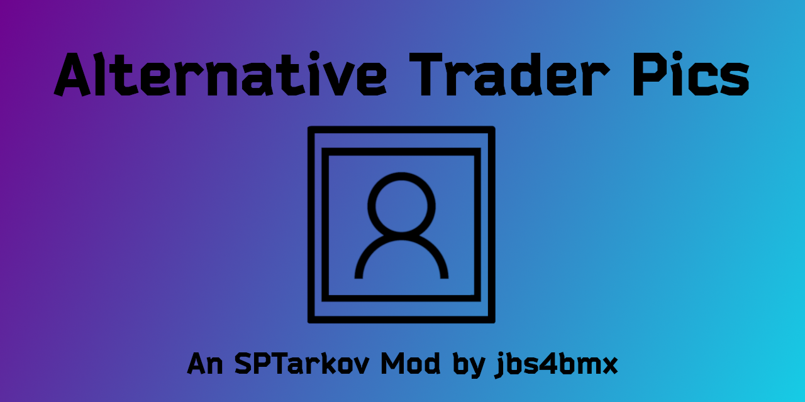

<a id="readme-top"></a>
[![Contributors][contributors-shield]][contributors-url]
[![Forks][forks-shield]][forks-url]
[![Stargazers][stars-shield]][stars-url]
[![Issues][issues-shield]][issues-url]
[![MIT License][license-shield]][license-url]

<!-- PROJECT LOGO -->
<br />
<div align="center">
  <a href="https://github.com/jbs4bmx/AlternativeTraderPics">
    
  </a>

  <h3 align="center">Alternative Trader Pics</h3>

  <p align="center">Update your trader avatars to a better looking alternative!<br /></p>

  [](https://ko-fi.com/X8X611JH15)
</div>


<!-- TABLE OF CONTENTS -->
<details>
  <summary>Table of Contents</summary>
  <ol>
    <li>
      <a href="#about-the-project">About The Project</a>
      <ul>
        <li><a href="#built-with">Built With</a></li>
      </ul>
    </li>
    <li>
      <a href="#getting-started">Getting Started</a>
      <ul>
        <li><a href="#prerequisites">Prerequisites</a></li>
        <li><a href="#installation">Installation</a></li>
      </ul>
    </li>
    <li>
      <a href="#configuration">Configuration</a>
      <ul>
        <li><a href="#image-customization">Image Customization</a></li>
        <li><a href="#mod-faq">Mod FAQ</a></li>
      </ul>
    </li>
    <li><a href="#roadmap">Roadmap</a></li>
    <li><a href="#contributing">Contributing</a></li>
    <li><a href="#license">License</a></li>
    <li><a href="#acknowledgments">Acknowledgments</a></li>
  </ol>
</details>


<!-- ABOUT THE PROJECT -->
## About The Project
Type: Server Mod</br>
Disclaimer: **This mod is provided _as-is_ with _no guarantee_ of support.**

Description:</br>
Replaces the server method that displays the trader avatars with a custom method that uses custom image files for the trader avatars. These can be changed out to any avatars(images) desired, provided that you follow the steps to ensure that they all match filetypes and are of equal or very similar size.

Example Image:</br>


<p align="right">(<a href="#readme-top">back to top</a>)</p>


### Built With
| Frameworks/Libraries                                      | Name         | Link                                       |
| :-------------------------------------------------------: | :----------: | :----------------------------------------: |
|       | `TypeScript` | [TypeScript Website][TypeScript-url]       |
|            | `Batch`      | [Batch Documentation][Batch-url]           |

|                         IDEs                                |      Name       | Link                                      |
| :---------------------------------------------------------: | :-------------: | :---------------------------------------: |
|      | `VSCodium`      | [VSCodium Website][Vscodium-url]          |

<p align="right">(<a href="#readme-top">back to top</a>)</p>


<!-- GETTING STARTED -->
## Getting Started
This section will explain how to install and use this mod.

### Prerequisites
EFT and SPT are required to use this mod.

### Installation
_For the purpose of these directions, "[SPT]" represents your SPT folder path._

Start by downloading the mod from the [Releases](https://github.com/jbs4bmx/AlternativeTraderPics/releases) page.

Follow these steps to install and configure the mod:
  1. Extract the contents of the zip file into the root of your [SPT] folder.
     - That's the same location as "SPT.Server.exe" and "SPT.Launcher.exe".
  2. Edit the Config to adjust the values to your liking.
  3. Start SPT.Server.exe and wait until it fully loads.
  4. Start SPT.Launcher.exe but do not launch the game.
  5. Run the cache cleaner found in the launcher's settings menu.
  6. Now you can launch the game and profit.

<p align="right">(<a href="#readme-top">back to top</a>)</p>


<!-- CONFIGURATION EXAMPLES -->
## Configuration
You can specify which images you want to change and leave the rest as their defaults. Default is to change all supported trader images (default traders and mod traders). To change this, set the line '**updateAllTraders**' to *false* and then enable or disable the trader(s) of your choice in the options below by setting them to *true*. '**updateAllTraders**' will override other options when set to *true*.
```jsonc
{
  // ======================================================================================
  // Sets the extension of the image files. (Only one supported extension at a time.)
  // Default = "jpg"
  // It is recommended that you do not change this setting.
  // ======================================================================================
  "extension": "jpg",


  // ======================================================================================
  // Update all supported traders (including any potentially supported mod traders).
  // 'BTR Driver' is considered WIP and may not work yet.
  // Default = true
  // ======================================================================================
  "updateAllTraders": true,


  // ======================================================================================
  // Choose which traders you want to update.
  // The setting 'updateAllTraders' must be set to false for these options to work.
  // ======================================================================================
  //*_____DEFAULT TRADERS_____*/
  "updatePrapor": false,
  "updateTherapist": false,
  "updateFence": false,
  "updateSkier": false,
  "updatePeacekeeper": false,
  "updateMechanic": false,
  "updateRagman": false,
  "updateJaeger": false,
  "updateLightKeeper": false,
  "updateBTRDriver": false,
  "updateRef": false,

  //*_____MOD TRADERS_____*/
  "AIOTrader": false,
  "AKGuy": false,
  "AnastasiaSvetlana": false,
  "ARSHoppe": false,
  "Bootlegger": false,
  "DRIP": false,
  "GearGal": false,
  "GoblinKing": false,
  "Gunsmith": false,
  "IProject": false,
  "KatarinaBlack": false,
  "KeyMaster": false,
  "MFACShop": false,
  "Priscilu": false,
  "Questor": false,
  "TheBroker": false
}
```

<p align="right">(<a href="#readme-top">back to top</a>)</p>

### Image Customization
You can customize it too! You can replace the traders with whatever pictures you like.

Follow these guidelines to make sure the new pictures fit the item frames within the game.
  * Recommended shape = square, but round images can also be used.
  * Transparency is ok.
  * Recommended photo size = 512x for best compatibility.
    * Pictures can be larger (1024x, 2048, etc.), but it requires more memory to store the larger file sizes while the game is running. Do so at your own risk.
    * It can take longer for the game to load the images if there are a lot of large file sizes.
  * Recommended filetypes = jpg or png (pick one; default is jpg).
  * Do not use both jpg and png at the same time. While it can be done, it is recommended to stick to one filetype at a time.

**EXAMPLE: PRAPOR --> .\res\59b91ca086f77469a81232e4.JPG (IMAGE SIZE 512X512)**
  * If you would like to replace this picture, rename the picture of your choosing to include the same string "59b91ca086f77469a81232e4" and copy it to the .\res folder.
  * If a file of the same name exists, click on "Yes" or "OK" to overwrite it.
  * To change to png from jpg, and vice versa, you will need to edit the ./src/config.js file.

<p align="right">(<a href="#readme-top">back to top</a>)</p>

### Mod FAQ
**Q: Why aren't the trader images changing?** <br>
A: The cached default images can override custom images if they are currently present when first using this mod. To get around this, you can use the included batch script in the mod's main folder to backup the default images so that custom images will load. The script name is "Rename-Cached_Images.bat". Just double-click it to launch and follow the on-screen prompts. (Note: This script also lets you restore your default images, should you ever want to uninstall this mod. Just run it again and follow the prompts.)

**Q: Do you plan on supporting other trader mods?** <br>
A: Short answer: yes. <br>
A: Long answer: I plan to update this mod to support as many trader mods as possible, however, I cannot guarantee any sort of an ETA for those updates.

<p align="right">(<a href="#readme-top">back to top</a>)</p>


<!-- ROADMAP -->
## Roadmap
- [ ] Add new trader avatars.
- [ ] Add support for more mod trader avatars.
- [ ] Add option to select from different types of avatars:
    - [ ] Anime avatars.
    - [ ] Realistic avatars.
    - [ ] New Custom Halloween avatars.
    - [ ] New Custom Christmas avatars.
    - [ ] Furry avatars?
    - [ ] Cat avatars?
- [X] Update Readme, license, and change log files.
- [X] Add new logo and banner images.

Suggest changes or view/report issues [here](https://github.com/jbs4bmx/AlternativeTraderPics/issues).

<p align="right">(<a href="#readme-top">back to top</a>)</p>


<!-- CONTRIBUTING -->
## Contributing
Contributions are what make the open source community such an amazing place to learn, inspire, and create. Any contributions you make are **greatly appreciated**.

If you have a suggestion that would make this better, please fork the repo and create a pull request. You can also simply open an issue with the tag "enhancement".
Don't forget to give the project a star! Thanks again!

1. Fork the Project
2. Create your Feature Branch (`git checkout -b feature/AmazingFeature`)
3. Commit your Changes (`git commit -m 'Add some AmazingFeature'`)
4. Push to the Branch (`git push origin feature/AmazingFeature`)
5. Open a Pull Request

You can also buy me a coffee! (This is not required, but I greatly appreciate any support provided.)</br>
[](https://ko-fi.com/X8X611JH15)

<p align="right">(<a href="#readme-top">back to top</a>)</p>


<!-- LICENSE -->
## License

Distributed under the MIT License. See `LICENSE.txt` for more information.

<p align="right">(<a href="#readme-top">back to top</a>)</p>


<!-- ACKNOWLEDGMENTS -->
## Acknowledgments
Contributors:
1. [revingly](https://hub.sp-tarkov.com/user/7947-revingly)
   - Code optimizations.
2. [Artist Credit for image sources.](./CREDITS.md)

<p align="right">(<a href="#readme-top">back to top</a>)</p>


<!-- Repository Metrics -->
[contributors-shield]: https://img.shields.io/github/contributors/jbs4bmx/AlternativeTraderPics.svg?style=for-the-badge
[contributors-url]: https://github.com/jbs4bmx/AlternativeTraderPics/graphs/contributors
[forks-shield]: https://img.shields.io/github/forks/jbs4bmx/AlternativeTraderPics.svg?style=for-the-badge
[forks-url]: https://github.com/jbs4bmx/AlternativeTraderPics/network/members
[stars-shield]: https://img.shields.io/github/stars/jbs4bmx/AlternativeTraderPics.svg?style=for-the-badge
[stars-url]: https://github.com/jbs4bmx/AlternativeTraderPics/stargazers
[issues-shield]: https://img.shields.io/github/issues/jbs4bmx/AlternativeTraderPics.svg?style=for-the-badge
[issues-url]: https://github.com/jbs4bmx/AlternativeTraderPics/issues
[license-shield]: https://img.shields.io/github/license/jbs4bmx/AlternativeTraderPics.svg?style=for-the-badge
[license-url]: https://github.com/jbs4bmx/AlternativeTraderPics/blob/master/LICENSE.txt


<!-- Framwork/Library URLs -->
[TypeScript-url]: https://www.typescriptlang.org/
[Batch-url]: https://learn.microsoft.com/en-us/windows-server/administration/windows-commands/windows-commands
[Vscodium-url]: https://vscodium.com/
